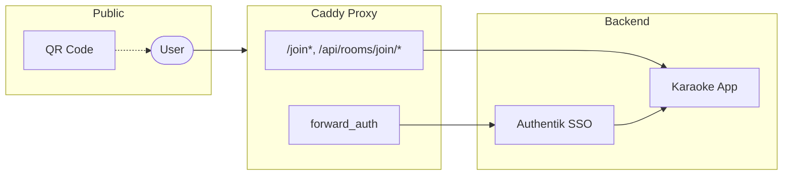
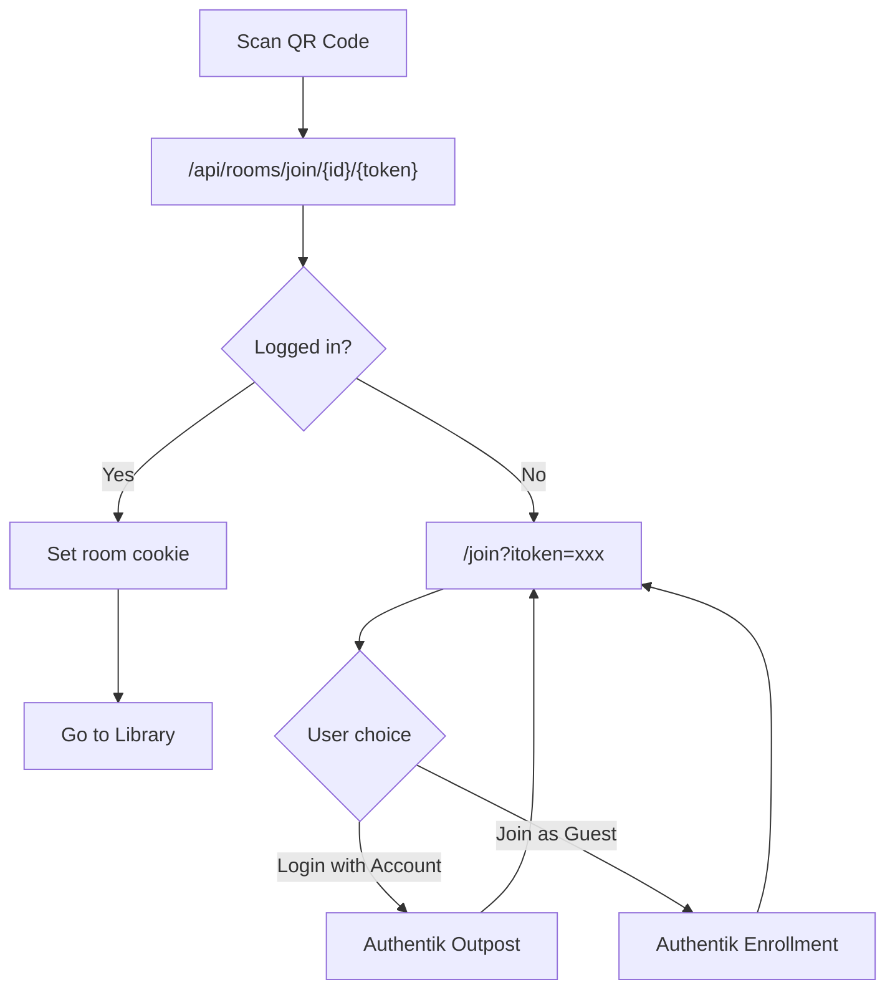

<div align="center">

# Karaoke Eternal

### Automated Edition

A **Multi-Tenant SSO** fork of [Karaoke Eternal](https://github.com/bhj/KaraokeEternal)

[](LICENSE)
[](https://nodejs.org/)
[](https://goauthentik.io/)

*SSO-powered karaoke with QR-based guest enrollment.*

---

</div>

## Features

- **SSO Integration** — Authenticate via Authentik; standard users land in their own room
- **Per-User Rooms** — Every standard user gets their own private party room
- **QR Guest Enrollment** — Guests scan a QR code, see a landing page, and join with one click
- **Multi-Tenancy** — Multiple hosts can run separate parties simultaneously
- **Room Roaming** — Standard users can visit other rooms via QR code

---

## Architecture



### User Flows



The app trusts headers from the reverse proxy (`KES_REQUIRE_PROXY=true`):

| Header | Purpose |
|--------|---------|
| `X-Authentik-Username` | User identity |
| `X-Authentik-Groups` | Role assignment (admin/standard/guest) |
| `X-Authentik-Karaoke-Room-Id` | Guest room routing |

---

## Getting Started

### Prerequisites

- **Node.js** 20+
- **Reverse Proxy** (Caddy recommended)
- **Identity Provider** (Authentik)
- **SQLite** (bundled)

### Installation

```bash
git clone https://github.com/Zardoz8901/KaraokeEternalAutomated.git
cd KaraokeEternalAutomated
npm install
npm run build
```

### Running

```bash
# Development
npm run dev

# Production
npm start
```

---

## Configuration

<details>
<summary><strong>Required Environment Variables</strong></summary>

| Variable | Description | Example |
|----------|-------------|---------|
| `KES_REQUIRE_PROXY` | Trust proxy headers only | `true` |
| `KES_TRUSTED_PROXIES` | Allowed proxy IPs | `127.0.0.1,::1` |

</details>

<details>
<summary><strong>SSO Headers</strong></summary>

| Variable | Default | Description |
|----------|---------|-------------|
| `KES_AUTH_HEADER` | `X-Authentik-Username` | Username header |
| `KES_GROUPS_HEADER` | `X-Authentik-Groups` | Groups header |
| `KES_ADMIN_GROUP` | `karaoke-admins` | Admin group name |
| `KES_GUEST_GROUP` | `karaoke-guests` | Guest group name |
| `KES_SSO_SIGNOUT_URL` | — | Logout redirect (e.g., `/outpost.goauthentik.io/sign_out`) |

</details>

<details>
<summary><strong>Authentik API (Guest Invitations)</strong></summary>

| Variable | Description |
|----------|-------------|
| `KES_AUTHENTIK_URL` | Internal API URL (e.g., `http://authentik:9000`) |
| `KES_AUTHENTIK_PUBLIC_URL` | Public URL for redirects (e.g., `https://auth.example.com`) |
| `KES_AUTHENTIK_API_TOKEN` | API token with invitation permissions |
| `KES_AUTHENTIK_ENROLLMENT_FLOW` | Flow slug (default: `karaoke-guest-enrollment`) |

</details>

---

## Authentik Setup

### 1. Property Mapping (Guest Room Header)

Create a Property Mapping to pass the guest's room assignment.

**Name:** `karaoke-room-id`

**Expression** (Proxy Provider forward-auth):
```python
return {
    "ak_proxy": {
        "user_attributes": {
            "additionalHeaders": {
                "X-Authentik-Karaoke-Room-Id": request.user.attributes.get("karaoke_room_id", "")
            }
        }
    }
}
```

> Assign this mapping to your Proxy Provider under **Property Mappings**.

### 2. Caddy Configuration

Two endpoints must bypass Authentik:
1. **Landing page** (`/join*`) — Shows room preview and login options
2. **Smart QR API** (`/api/rooms/join/*`) — Validates invitations and routes users

```caddyfile
karaoke.example.com {
    # Proxy outpost endpoints
    reverse_proxy /outpost.goauthentik.io/* authentik:9000

    # Landing page - bypass auth (shows join options)
    @landing_page path /join*
    handle @landing_page {
        reverse_proxy karaoke:3000
    }

    # Smart QR API - bypass auth (app handles routing)
    @guest_join path /api/rooms/join/*
    handle @guest_join {
        reverse_proxy karaoke:3000
    }

    # Everything else - require Authentik auth
    handle {
        forward_auth authentik:9000 {
            uri /outpost.goauthentik.io/auth/caddy
            copy_headers X-Authentik-Username X-Authentik-Groups X-Authentik-Karaoke-Room-Id
        }
        reverse_proxy karaoke:3000
    }
}
```

> **Important:** Bypass handlers MUST come before the default `handle` block.

**Security notes:**
- `/join*` only shows room name preview — no sensitive data
- `/api/rooms/join/*` validates UUIDs (2^122 possibilities) before any action
- Logged-in users: validates invite, sets cookie, redirects to library
- Guests: redirects to Authentik enrollment flow

### 3. Guest Enrollment Flow

Create an enrollment flow (`karaoke-guest-enrollment`) with stages:

1. **Prompt** — Captures `username` (pre-filled from `guest_name` URL param) and `itoken` (hidden)
2. **User Write** — Creates user in `karaoke-guests` group with collision handling
3. **Login** — Issues session cookie
4. **Redirect** — Returns to `/join?itoken={itoken}` to complete room join

**Flow:**
```
Guest scans QR → /api/rooms/join/{roomId}/{itoken}
  → Redirects to /join?itoken=xxx&guest_name=RedPenguin
  → Landing page: "Login with Account" or "Join as RedPenguin"
  → Guest clicks join → Authentik enrollment
  → Account created → Redirect to /join?itoken=xxx
  → App auto-completes join → Library
```

> See `docs/operations/authentik-guest-enrollment.md` for detailed setup.

---

## Security

| Risk | Mitigation |
|------|------------|
| Header spoofing | `KES_REQUIRE_PROXY=true` + IP whitelist |
| Direct port access | Never expose 8280; use reverse proxy |
| Cookie theft | `httpOnly`, `Secure`, `SameSite=Lax` |
| Guest persistence | 7-day auto-expiration |

> **HTTPS required** for secure cookies.

---

## Running Tests

```bash
npm test
```

---

## Built With

- [Koa](https://koajs.com/) — Web framework
- [Socket.io](https://socket.io/) — Real-time communication
- [SQLite](https://sqlite.org/) — Database
- [React](https://react.dev/) — Frontend
- [Authentik](https://goauthentik.io/) — Identity Provider

---

## Contributing

See [CONTRIBUTING.md](CONTRIBUTING.md) for guidelines.

---

## License

[ISC License](LICENSE) — Forked from [Karaoke Eternal](https://github.com/bhj/KaraokeEternal) by RadRoot LLC.

---

## Acknowledgments

- [bhj/KaraokeEternal](https://github.com/bhj/KaraokeEternal) — Original project
- [Authentik](https://goauthentik.io/) — Identity provider
