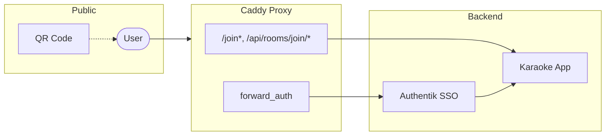
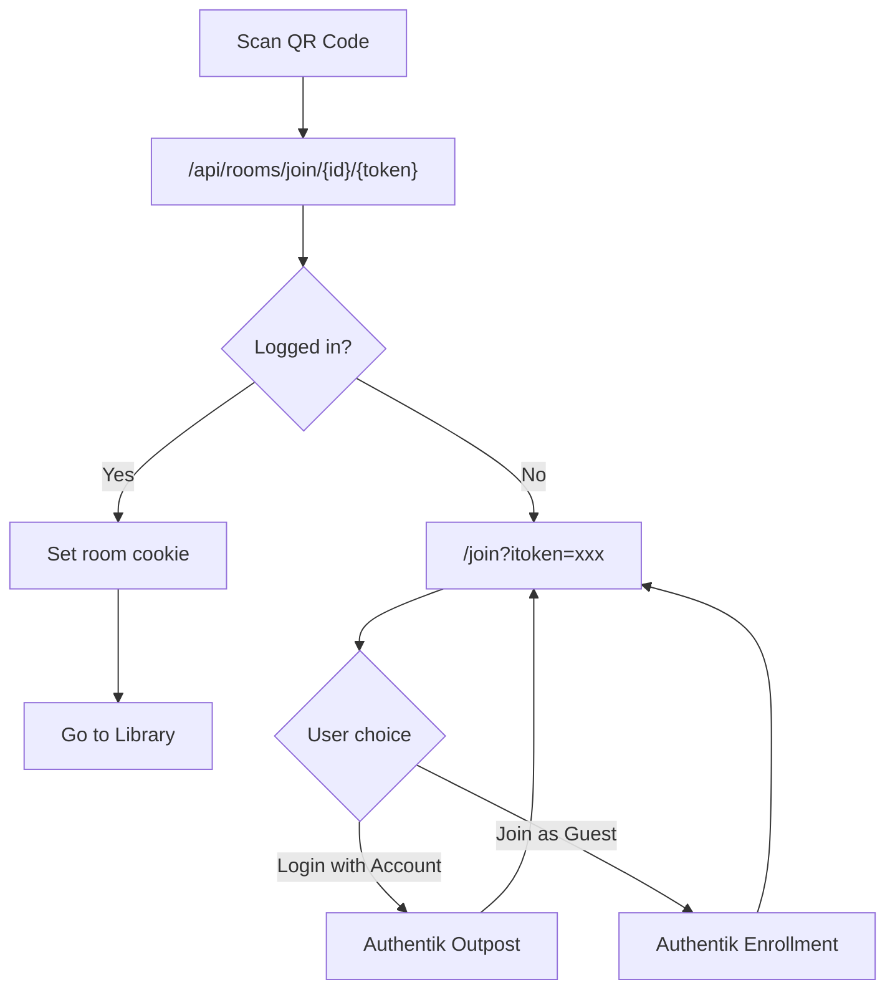

# Architecture

This document describes the system architecture for Karaoke Eternal Automated Edition.

## System Overview

## User Flows

### QR Code Join Flow

## Proxy Headers

The app trusts headers from the reverse proxy when `KES_REQUIRE_PROXY=true`:

| Header | Purpose |
|--------|---------|
| `X-Authentik-Username` | User identity |
| `X-Authentik-Groups` | Role assignment (admin/standard/guest) |
| `X-Authentik-Karaoke-Room-Id` | Guest room routing |

## Components

### Server Stack
- **Koa** — HTTP framework
- **Socket.io** — Real-time queue updates
- **SQLite** — Embedded database
- **better-sqlite3** — Sync SQLite driver

### Client Stack
- **React** — UI framework
- **Redux** — State management
- **Socket.io-client** — Real-time updates

### Infrastructure
- **Caddy** — Reverse proxy with forward_auth
- **Authentik** — Identity provider (OIDC/SAML)

## Data Flow

1. **Authentication**: User → Caddy → Authentik → Headers injected → App
2. **Room Access**: QR scan → Validate token → Set cookie → Route to room
3. **Queue Updates**: Client ↔ Socket.io ↔ Server → Broadcast to room

## Related Documentation

- [Authentik Setup](AUTHENTIK_SETUP.md) — SSO configuration
- [Security](SECURITY.md) — Security model and hardening
- [SSO Overlay Architecture](architecture/sso-overlay.md) — Detailed SSO integration
