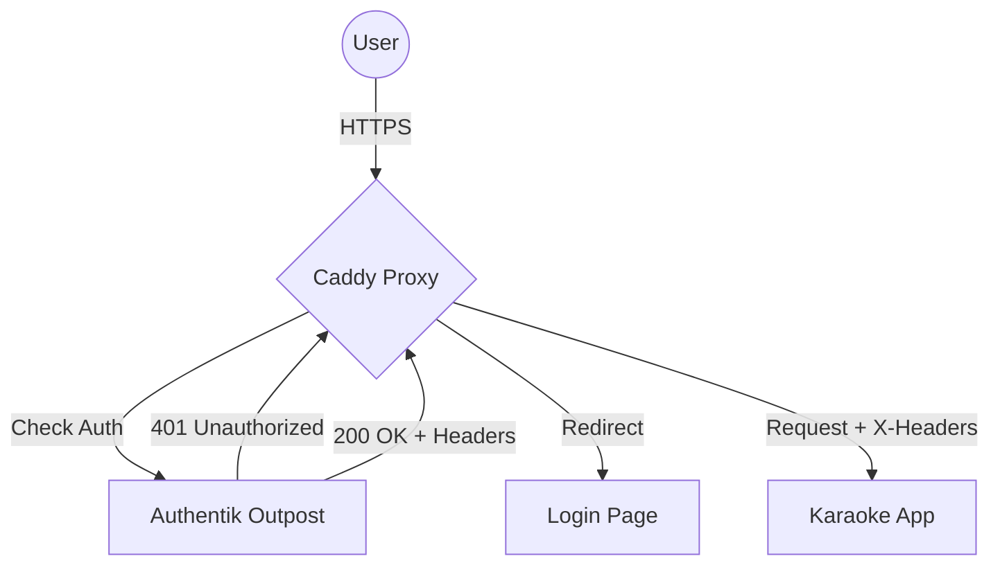
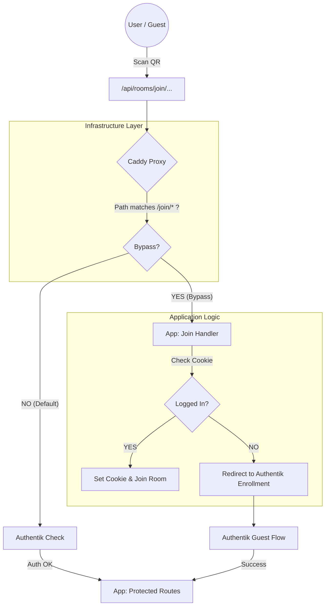

# Architecture: SSO Integration Overlay

This document visualizes how the "Smart QR" system overlays onto the standard Forward Auth architecture.

## The Standard Flow (Strict Forward Auth)
In a standard setup, the Proxy (Caddy) enforces authentication for 100% of requests.

## The Overlay Flow (Smart QR Bypass)
To support a unified entry point for Guests and Users, we poke a specific hole in the Proxy layer.

## Why this is necessary
1.  **Context Awareness:** The *Proxy* doesn't know if the user intends to "Join a Room" or "Hack the Admin Panel". It just sees "Not Logged In".
2.  **The App Knows:** The *App* knows that `/join/123/abc` is a special intent. It can make the intelligent decision to send guests to a specific *Enrollment Flow* (for that room) rather than a generic Login Page.
3.  **Friction Reduction:** Existing users (who have a cookie) skip the Authentik check entirely for this specific action, preventing "User Already Exists" errors from the enrollment flow.
