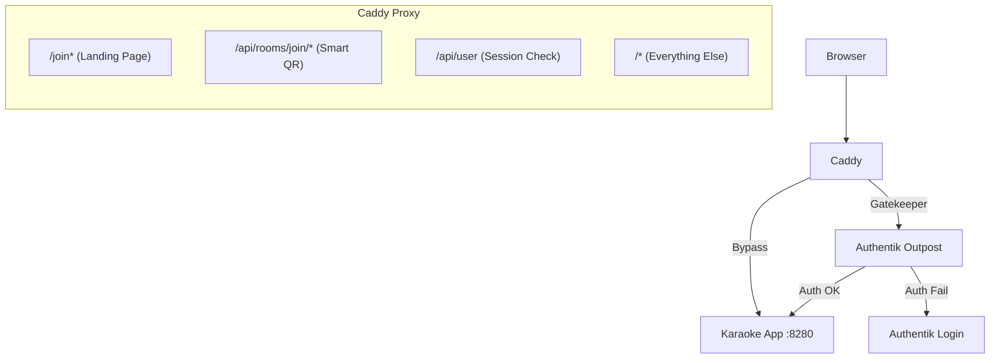

# Debugging: Authentik + Caddy + App Flow

## Architecture Reference



---

## 1. Quick Checks (The "Is it Plugged In?" Test)

Run these from your local machine or server. Replace `karaoke.thedb.club` with your domain.

### A. Test Caddy Bypass (Landing Page)
**Goal:** Should return the React App HTML, **NOT** an Authentik redirect.
```bash
curl -I https://karaoke.thedb.club/join?itoken=test
```
*   ✅ **Good:** `HTTP/2 200` (content-type: text/html)
*   ❌ **Bad:** `HTTP/2 302` (Location: auth.thedb.club/...) -> **Fix Caddy Config.**

### B. Test API Bypass (Session Check)
**Goal:** Should return `401 Unauthorized` JSON, **NOT** an HTML Login Page.
```bash
curl -I https://karaoke.thedb.club/api/user
```
*   ✅ **Good:** `HTTP/2 401`
*   ❌ **Bad:** `HTTP/2 200` (content-type: text/html) -> **Fix: Add `/api/user` to Caddy bypass.**
*   *Note:* If this returns HTML, the app state will corrupt ("White Screen of Death").

---

## 2. Infrastructure Config (The Source of Truth)

### Caddy Configuration
**File:** `~/nix-config/hosts/thedb-server/nixos/caddy.nix`

Verify these blocks exist **BEFORE** the main `handle` block:

```nix
# 1. Landing Page Bypass
@landing_page path /join*
handle @landing_page {
  reverse_proxy localhost:8280
}

# 2. Smart QR Bypass
@smart_join path /api/rooms/join/*/*
handle @smart_join {
  reverse_proxy localhost:8280
}

# 3. API Bypass (Prevents State Corruption)
@session_check path /api/user
handle @session_check {
  reverse_proxy localhost:8280
}
```

### Authentik Configuration
**Flow:** `karaoke-guest-enrollment`

1.  **Prompt Stage:**
    *   Fields: `username` (Text), `itoken` (Hidden).
    *   *Critical:* Must capture `itoken` from URL.
2.  **Redirect Stage:**
    *   Expression: `return f"/join?itoken={request.context.prompt_data.itoken}"`
    *   *Critical:* Must send user back to the App Landing Page, not the Root.

---

## 3. Browser Debugging (Console)

If the app loads but behaves strangely:

1.  **Network Tab:** Filter for `user`.
    *   Look at the request to `GET /api/user`.
    *   **Response:** Is it JSON `{"userId":...}` or HTML `<!DOCTYPE html>`?
    *   *HTML means Caddy is NOT bypassing the route.*

2.  **Redux State:**
    *   If `user.userId` looks like `http://...` or garbage string -> **State Corruption**.
    *   **Fix:** Clear Local Storage (Application -> Local Storage -> Clear).

---

## 4. The Full Trace (Step-by-Step)

### Guest Flow
1.  **Scan:** Guest scans QR -> `https://karaoke.thedb.club/api/rooms/join/77/uuid`
2.  **App:** Server receives request (unauthenticated).
3.  **App:** Redirects to -> `/join?itoken=uuid&guest_name=BlueWolf`
4.  **Landing:** User sees "Join as BlueWolf". Clicks Button.
5.  **Authentik:** User redirected to `auth.thedb.club/...`
6.  **Authentik:** Creates User `BlueWolf`. Logs them in. Sets `karaoke_room_id` attribute.
7.  **Authentik:** Redirects back to -> `https://karaoke.thedb.club/` (goes through forward_auth)
8.  **Caddy:** forward_auth adds `X-Authentik-Karaoke-Room-Id: 77` header
9.  **App:** Creates session with room already assigned from header
10. **Success:** User lands in library, in their room.

### Login Flow (Standard User)
1.  **Scan:** User scans QR.
2.  **App:** Server receives request (unauthenticated).
3.  **App:** Redirects to -> `/join?itoken=uuid`
4.  **Landing:** User clicks "Login with Account".
5.  **Authentik:** User logs in. Redirects to `/join?itoken=uuid`
6.  **Landing:** App detects login + token (userId in Redux).
7.  **Action:** App auto-redirects to `/api/rooms/join/:roomId/:itoken`
8.  **App:** Server validates token, sets `keVisitedRoom` cookie
9.  **Success:** User lands in their room.
