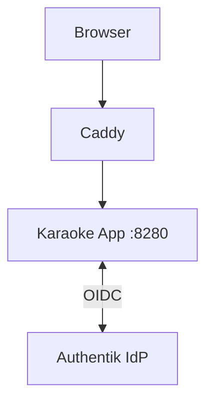

# Debugging: App-Managed OIDC Auth Flow

## Architecture Reference



---

## 1. Quick Checks

Run these from your local machine or server. Replace `karaoke.thedb.club` with your domain.

### A. Test API Access
**Goal:** Should return `401 Unauthorized` JSON for unauthenticated requests.
```bash
curl -s -w "\n%{http_code}" https://karaoke.thedb.club/api/user
```
* ✅ **Good:** `401`
* ❌ **Bad:** `200` with HTML body → **App misconfiguration**

### B. Test OIDC Login
**Goal:** Should redirect to Authentik authorization URL.
```bash
curl -I https://karaoke.thedb.club/api/auth/login
```
* ✅ **Good:** `302` with `Location: https://auth.thedb.club/application/o/authorize/...`
* ❌ **Bad:** `500` or error → **Check OIDC env vars**

### C. Test Public Prefs
**Goal:** Should return JSON with OIDC configuration.
```bash
curl https://karaoke.thedb.club/api/prefs/public | jq
```
* ✅ **Good:** `{"ssoLoginUrl":"/api/auth/login",...}`
* ❌ **Bad:** Empty or error → **Check app startup logs**

---

## 2. OIDC Configuration

### Environment Variables

```bash
# Required
KES_OIDC_ISSUER_URL=https://auth.thedb.club/application/o/karaoke-eternal/
KES_OIDC_CLIENT_ID=<from-authentik>
KES_OIDC_CLIENT_SECRET=<from-authentik>

# Group mapping
KES_ADMIN_GROUP=karaoke-admin
KES_GUEST_GROUP=karaoke-guests
```

### Authentik Provider Settings

1. **Provider Type:** OAuth2/OpenID Provider
2. **Client Type:** Confidential
3. **Redirect URI:** `https://karaoke.thedb.club/api/auth/callback`
4. **Scopes:** `openid`, `profile`, `email`, `groups`
5. **Subject Mode:** Based on User's username

---

## 3. Browser Debugging

If the app loads but behaves strangely:

1. **Network Tab:** Filter for `user`.
   * Look at the request to `GET /api/user`.
   * **Response:** Is it JSON `{"userId":...}` or error?

2. **Redux State:**
   * If `user.userId` looks garbage → **Clear Local Storage**.
   * Application → Local Storage → Clear

---

## 4. The Full Trace (Step-by-Step)

### Guest Flow
1. **Scan:** Guest scans QR → `https://karaoke.thedb.club/api/rooms/join/77/uuid`
2. **App:** Server receives request (unauthenticated).
3. **App:** Redirects to → `/join?itoken=uuid&guest_name=BlueWolf`
4. **Landing:** User sees "Join as BlueWolf". Clicks "Join as Guest".
5. **App:** Creates guest session, sets JWT cookie, redirects to library.
6. **Success:** User lands in library, in their room.

### SSO Login Flow (Standard User)
1. **Scan:** User scans QR.
2. **App:** Server receives request (unauthenticated).
3. **App:** Redirects to → `/join?itoken=uuid`
4. **Landing:** User clicks "Login with Account".
5. **App:** Redirects to `/api/auth/login?redirect=/join?itoken=uuid`
6. **Authentik:** User authenticates. Redirects to `/api/auth/callback`.
7. **App:** Validates code, fetches user info, creates session, redirects.
8. **Landing:** App detects login + token (userId in Redux).
9. **Action:** App auto-joins room via `/api/rooms/join/:roomId/:itoken`
10. **Success:** User lands in their room.

---

## 5. Common Issues

### "Missing or expired state cookie"
**Cause:** OIDC callback received without matching state from login.
**Fix:** Ensure `/api/auth/login` is called before callback. Check cookie settings.

### "Invalid client credentials"
**Cause:** Wrong `KES_OIDC_CLIENT_ID` or `KES_OIDC_CLIENT_SECRET`.
**Fix:** Copy credentials from Authentik provider settings.

### "Groups claim missing"
**Cause:** Authentik not sending groups in ID token.
**Fix:** Add `groups` scope to provider and ensure user has group memberships.
